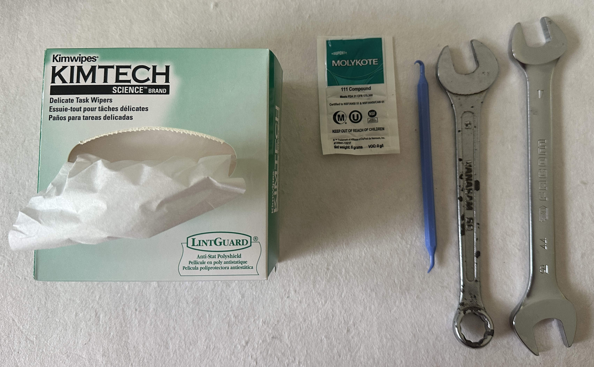
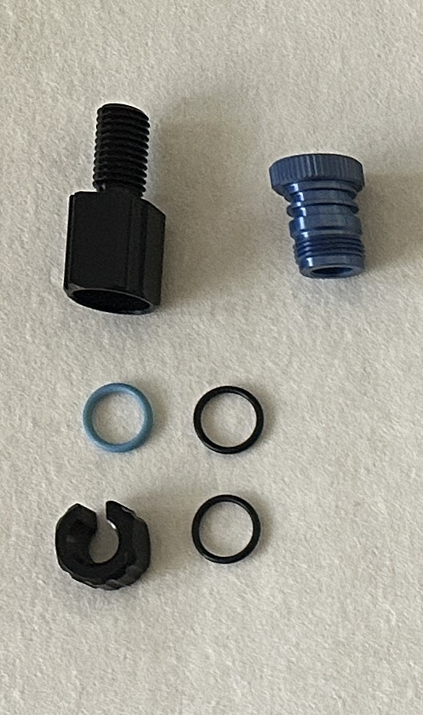
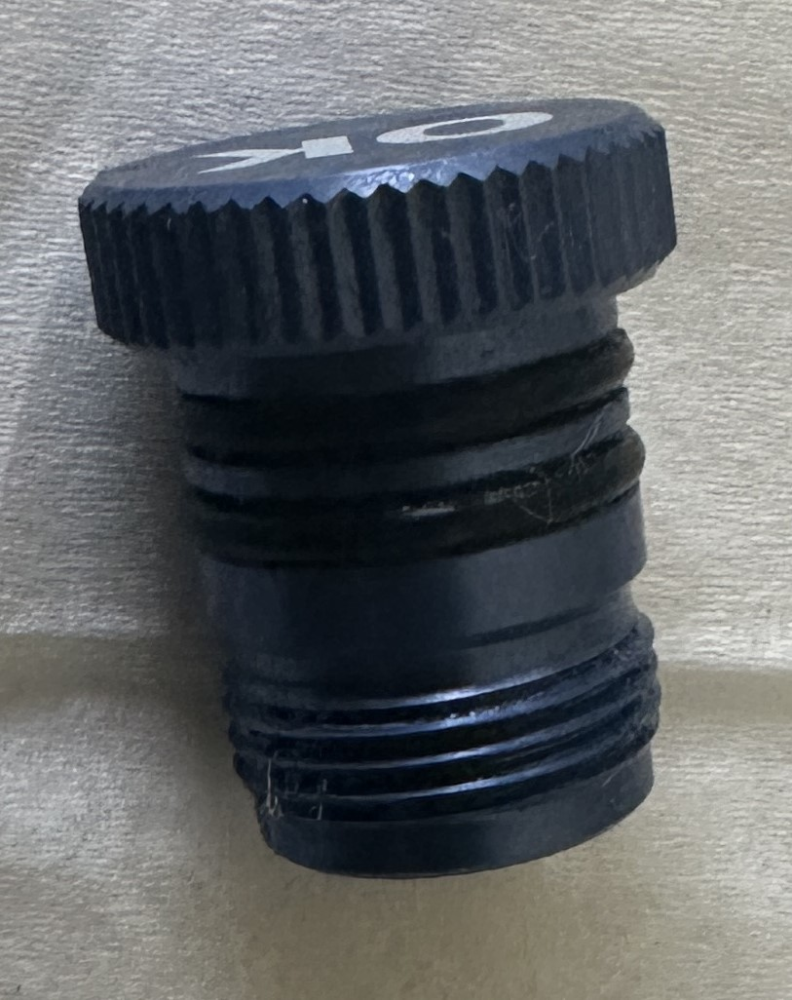
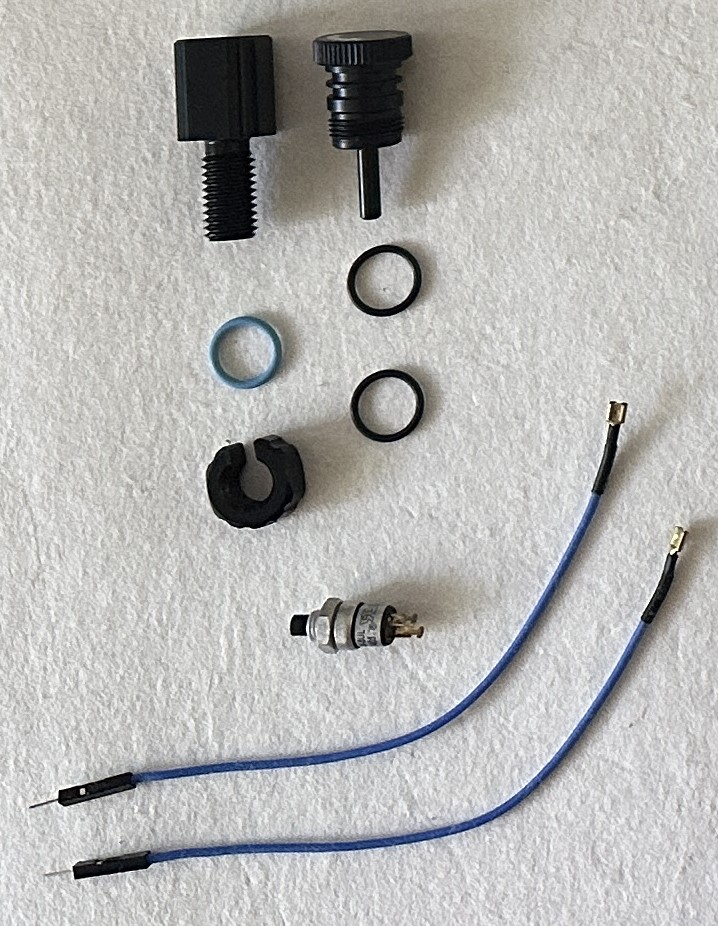
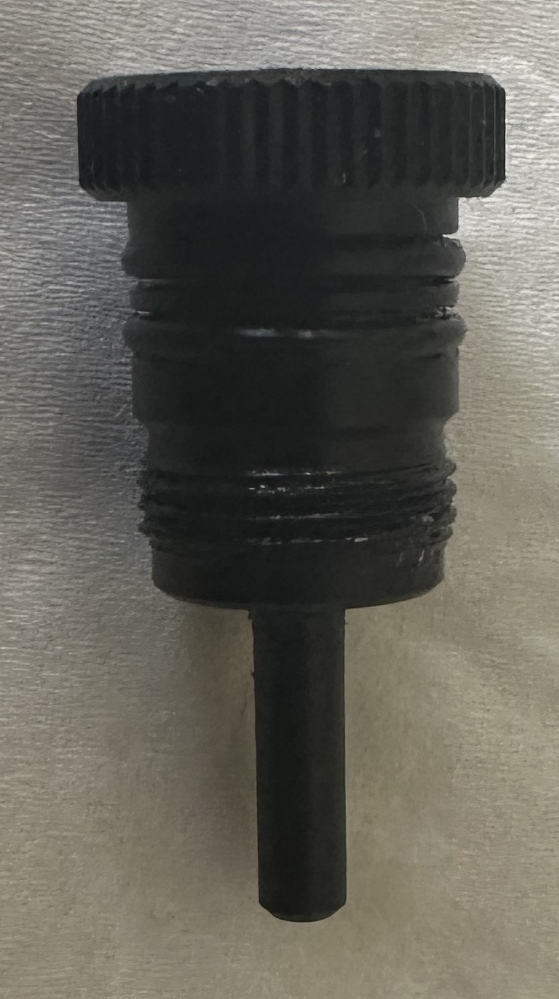

# **Outils**

- **Clés anglaises** 15 et 17
- **O-Ring pick** 
- **Graisse Molykotte** fournie avec les flanges BlueRobotics
- **Papier Kimtech**
  
## **Purge**

## **Switch**

## **Bouchon**

