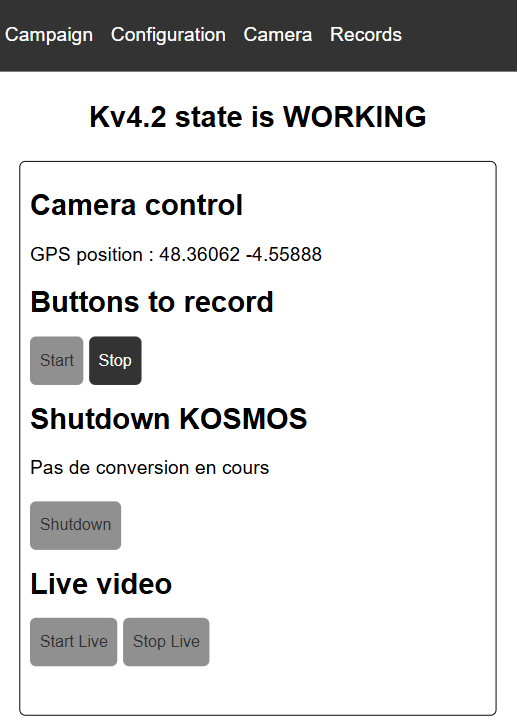
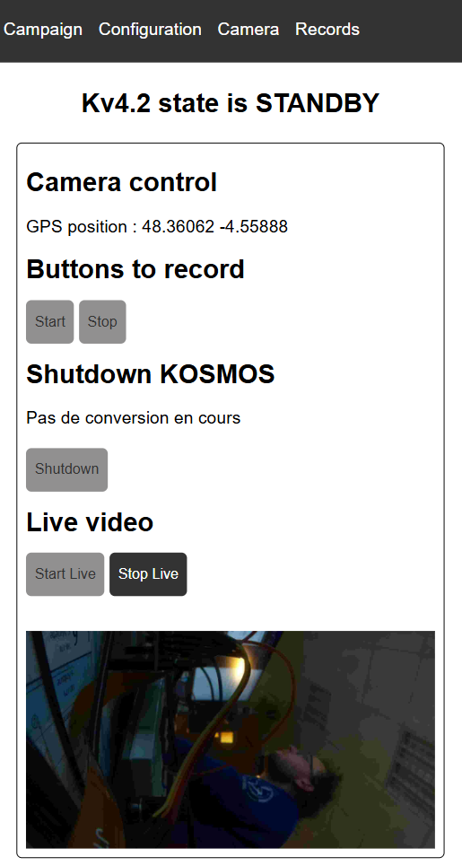
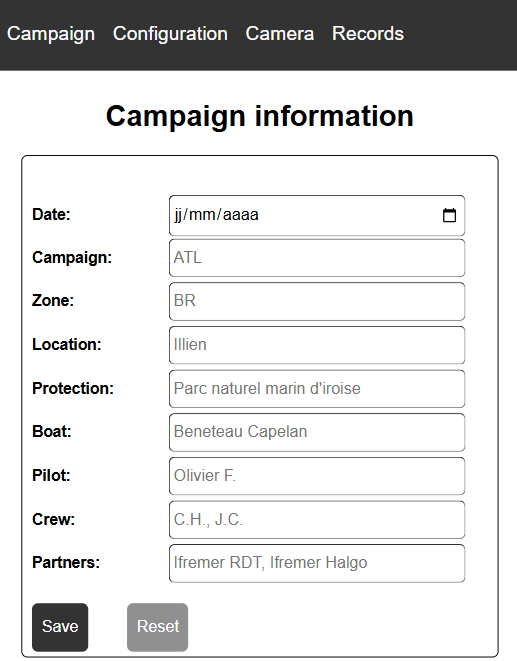
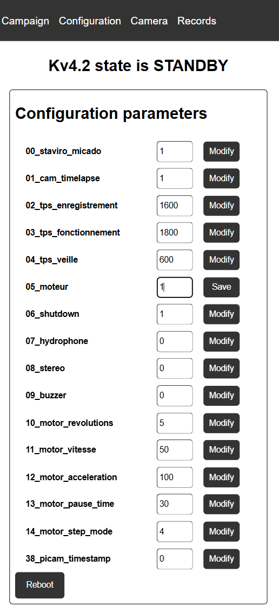
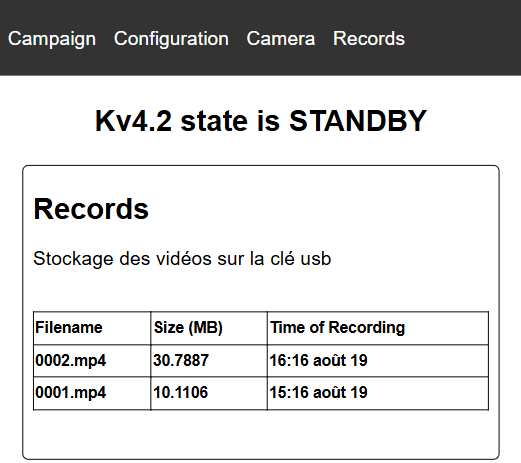

# Kosmos Software

## Stockage des données

Deux méthodes de stockage sont possibles : 
- en local sur la carte SD
- sur une clé USB.
Si une clé USB est branchée, elle sera prioritaire. Si aucune clé usb n'est branchée, les fichiers seront stockées dans `/home/kosmos/kosmos_local_sd`. Il faudra dans ce cas veiller à ce que la carte SD ait une capacité appropriée (on préconise au moins 64 Go).

Il peut arriver que la clé USB (si ce système de stockage est choisi), contienne déjà des vidéos ainsi qu'un fichier de configuration `kosmos_config.ini`. Nous recommandons de renommer ce dernier fichier (en `kosmos_config_old.ini`) pour éviter des bugs de compatibilité entre les versions du soft. Par ailleurs, il faudra veiller à ce que la clé propose assez de places pour accueillir les nouvelles vidéos. Typiquement prévoir 10Go par journée de campagne. 
  
Lorsque l'on démarre le système avec une clé vierge, un dossier et un ficher texte vont s'y créer. Si aucune clé n'est branchée, ces éléments seront dans `/home/kosmos/kosmos_local_sd`.


Le fichier kosmos_config.ini contient les paramètres de configuration du système. Ces paramètres seront visibles et modifiables depuis l'interface web.

Le dossier contenant les données associées à une journée de campagne s'appelle normalement `date_system`, typiquement `250403_KIMT`. Dans ce dossier, seront présents d'autres dossiers correspondant à chaque enregistrement. Ils auront pour nom l'`increment`, typiquement `0091`.


Chacun de ces dossiers contiennent une vidéo (voire deux si l'on filme en stéréo) et ses métadonnées. 
- Le fichier vidéo `increment.mp4` (et éventuellement increment_STEREO.mp4 si la stéréo est activée)
- Un fichier `increment.txt` qui stocke l'instant (ou timestamp en anglais) de chaque frame de la video.
- Un fichier `increment.csv` qui stocke des paramètres de la caméra ainsi que les données T,P, position et autres données fournies par les capteurs du système pendant la prise de vue.
- Un fichier `increment.json` qui stocke les métadonnées de la prise de vue.
- Un fichier `systemEvent.csv` qui stocke les évènements du sytème comme la rotation du moteur ou la mise à jour des gains de couleur AWB
- Un fichier `increment.wav` qui stocke l'enregistrement audio si l'hydrophone est activé.


### Video Continue

### Time Lapse


## Mode d'emploi de l'interface web

Une IHM (Interface Homme Machine) a été développée pour commander Kosmos depuis un téléphone ou un ordinateur portable. Elle remplace les étapes à réaliser avec les aimants dans le guide de mise en service. (À noter que le pilotage avec les aimants reste opérationnel sur les systèmes où sont installés les ILS.)

Sur un téléphone ou un ordinateur portable:
 - Se connecter au réseau  WiFi de la raspberry qui a été créé dans les étapes précédentes typiquement `KosmosWeb`.  
 - Dans un navigateur web, générer une fenêtre de navigation privée et entrer l'adresse `10.42.0.1` pour accéder à l'interface de commande du KOSMOS. 
La fenêtre suivante apparaît :


4 onglets sont disponibles à partir de cette page :

 - `Campaign` qui permet de renseigner les informations liées à la campagne journalière.
 - `Configuration` qui permet de configurer le système
 - `Camera` qui permet de lancer l'enregistrement des vidéos, de tester si la caméra fonctionne correctement et d'éteindre le système
 - `Records` qui permet de voir les vidéos enregistrées et leur lieu de stockage
   
A noter que l'adresse `10.42.0.1` renvoie directement vers la page `Camera`.

### Page `Camera`

Sur la page `Camera`, on peut tout d'abord lire l'état du KOSMOS. Sur l'image précédente, on lit en effet **`K4v2 state is STANDBY`**. (K4v2 est le nom du système et **STANDBY** son état.)  Il existe 5 états possible du KOSMOS :
 - **STARTING** : kosmos est en train de démarrer 
 - **STANDBY** : kosmos est en attente d'instructions 
 - **WORKING** : kosmos entame l'enregistrement
 - **STOPPING** : kosmos termine l'enregistrement 
 - **SHUTDOWN** : kosmos passe à l'arrêt total

Seuls les états **STANDBY** et **WORKING** permettent d'interagir avec le systèmes. Les boutons autorisés sont alors en noir. (Gris, ils sont désactivés.)
Dans l'état **STANDBY**, le système est en attente. Il est donc possible :
- de lancer un enregistrement (via le bouton `Start` de la section `Buttons to record`)
- d'éteindre le système (via le bouton `Shutdown`)
- de faire un test caméra avec le live vidéo (via le bouton `Start` de la section `Live video`)

Dans l'état **WORKING**, le système est en train d'enregistrer une vidéo. Le seul bouton autorisé est celui d'arrêt de la prise de vue (`Stop` de la section `Buttons to record`).



A noter que le `Live video` n'est possible que dans l'état STANDBY. Lorsqu'il est activé, des images basse résolution de la caméra sont visibles. Elles permettent de vérifier que tout est ok d'un point de vue optique (netteté, horizontalité du champ de vue, etc.) . Il faut nécessairement stopper le live pour pouvoir lancer un enregistrement ou éteindre la caméra.  



Enfin on notera la présence d'une ligne `GPS position`. Elle permet de vérifier que le système capte bien le GPS. Auquel cas, il n'est pas nécessaire de prendre cette information via un autre instrument (application de positionnement, GPS de poche). Ces positions seront en effet directement enregistrées dans les métadonnées. Si la ligne `GPS position` indique `ERR ERR`, c'est qu'il y a un problème avec le GPS. Il faut donc noter à la main la position GPS sur la feuille terrain.

### Page `Campaign`

Lors de la première tentative pour lancer un enregistrement avec le bouton `Start` de la section `Buttons to record` de la page `Camera`, un message d'erreur apparaît. 


Il signale qu'il faut au préalable renseigner les informations de la campagne. Cette précaution évite la perte de métadonnées. Il faut donc cliquer sur l'onglet `Campaign` en haut de la page. On arrive sur la page suivante :



Remplir chacune des lignes du tableau :
- `Date`: Date de la campagne journalière
- `Campaign`: Grand zone maritime dans laquelle s'effectue la campagne. Typiquement `ATL` pour Océan Atlantique, `MED` pour mer Méditerrannée, etc.
- `Zone`: Précision sur la zone de déploiement. Typiquement `BR` pour Brest, `CC`pour Concarneau, etc.
- `Location`: Lieudit du déploiement
- `Protection`: Statut de protection de la zone de déploiement. Mettre `Aucune` si il n'en existe pas.
- `Boat`: Moyen de déploiement.
- `Pilot`: Nom du pilote
- `Crew`: Noms des membres de l'équipage
- `Partners`: Noms des entreprises/laboratoires/associations participant au déploiement
Cliquer enfin sur le bouton `Save`. À noter que tous les champs sont obligatoires.


Tel que l'interface Web est construite, ces informations Campagne seront enregistrées tant que la fenêtre de navigation privée du navigateur ne sera pas fermée. Il faudra donc la laisser ouverte tout le long de la journée de déploiement. On pourra la fermer dès la dernière station réalisée. 

Une fois les données Campagne complétées, on peut revenir sur la page `Camera` pour lancer un enregistrement. Cependant, il peut arriver que l'on veuille auparavant configurer le système. Pour cela, il faut aller dans la page `Configuration`.

### Page `Configuration`

  

La page `Configuration` permet de régler les paramètres du KOSMOS. Pour effectuer la modification d'un paramètre, il faut
- cliquer sur le bouton `Modify` (qui devient alors un bouton `Save`),
- taper la nouvelle valeur du paramètre
- cliquer sur le bouton `Save`
- (éventuellement refaire cette opération pour un autre paramètre)
- cliquer sur le bouton `Reboot`
- attendre que l'état du système redevienne **STANDBY**  
Le système est alors prêt pour l'enregistrement

Quelques précisions quant à la configuration du KOSMOS. Les paramètres visibles dans l'interface Web sont stockés dans un fichier de configuration nommé `kosmos_config.ini`. Il est contenu soit dans la clé USB, soit dans `/home/kosmos/kosmos_local_sd` suivant qu'on choisisse l'un ou l'autre de ces solutions de stockage. 
Ce fichier `kosmos_config.ini`est découpé en deux sections permettant de distinguer des paramètres que l'on peut changer durant la campagne soit lors d'un débug. Les premiers paramètres sont modifiables via l'interface web, tandis que les seconds doivent être modifiés directement dans le fichier `.ini`.

#### Paramètres modifiables sur le terrain via l'interface Web

 - `00_STAVIRO_MICADO = 1` permet de permuter entre les modes de fonctionnement du KOSMOS.
   * `1` permet d'opter pour le mode STAVIRO, c'est-à-dire un fonctionnement de pose puis relevé rapide du système.
   * `2` correspond au mode MICADO qui correspond à une version pose longue du système.
 - `01_CAM_TIMELAPSE = 1` permet de permuter entre les modes vidéo ou photo.
   * `1` génére des vidéos
   * `2` génère des photos prises en rafale.
 - `02_TEMPS_ENRGISTREMENT = 1600` correspond au temps d'enregistement en secondes des séquences vidéos/rafale de photos. Si le système doit filmer plus longtemps que ce temps d'enregistrement, la vidéo sera découpée en plusieurs séquences. Ceci permet d'éviter la perte de données si un arrêt brutal se produit. 
 - `03_TPS_FONCTIONNEMENT = 1800` règle le temps en secondes avant l'extinction automatique (mode STAVIRO) ou de la mise en veille (mode MICADO) du système.
 - `04_TPS_VEILLE = 600` règle le temps de veille en mode MICADO. 
 - `05_MOTEUR = 1` déclenche `1` ou non `0` le fonctionnement du moteur et donc de la rotation.
 - `06_SHUTDOWN = 1`  permet d'éteindre ou non la Rpi lorsque le bouton arrêt est pressé. 
    * si `0`, le `shutdown` provoque l'arrêt du programme mais la Rpi reste allumée. On peut utiliser ce réglage pour le debug ou le développement software.
    * si `1`, le `shutdown` provoque l'arrêt du programme et de la Rpi. Privilégier ce mode sur le terrain.
 - `07_HYDROPHONE = 0` déclenche `1` ou non `0` le fonctionnement de l'hydrophone. (Attention, l'hydrophone perturbe la prise de vidéos... Ce bug reste à corriger.)
 - `08_STEREO = 0`  déclenche `1` ou non `0` la capture STEREO. A noter que le mode `1` n'est opérationnel que si deux caméras identiques sont détectées.
 - `09_BUZZER = 0` déclenche `1` ou non `0` le buzzer (disponible seulement pour la v4).
 - `38_picam_timestamp = 0` incruste ou non une horloge dans l'image
    * si `0` pas d'incrustation
    * si `1` incrustation
    *   
Pour le **Kosmos V3**, il est possible de régler les paramètres du moteur : 

 - `13_MOTOR_vitesse_min = 1000` vitesse minimale du moteur utilisée lors de son armement (peut-être inutile...)
 - `14_MOTOR_vitesse_favorite = 1350` vitesse nominale du moteur. A régler avant le départ en mission. Typiquement entre 1200 & 1600.
 - `15_MOTOR_pause_time = 27`  temps de pause en secondes entre les rotations (typiquement 27 secondes pour le protocole STAVIRO)
 - `16_MOTOR_inertie_time = 1000` temps en ms qui permet de décaler l'aimant d'asservissement du moteur suffisamment loin de l'ILS afin d'éviter son activation fortuite. A régler avant le départ en mission. Typiquement entre 500 et 2000.
 - `17_MOTOR_timeout = 5` temps de sécurité en s d'arrêt du moteur s'il n'a pas détecté l'ILS d'asservissement. A régler avant le départ en mission. Typiquement entre 5 et 10.
 - `18_motor_pressORrelease = 1`
 - `19_motor_shift_time = 2000`

Pour le **KOSMOS V4**, ces paramètres sont différents :
- `10_motor_revolutions = 5`
- `11_motor_vitesse = 50`
- `12_motor_acceleration = 100`
- `13_motor_pause_time = 30`
- `14_motor_step_mode = 4`
- `15_motor_i2c_communication_period = 1`

#### Paramètres non modifiables sur le terrain

Pour jouer sur ces paramètres, il faut donc ouvrir le fichier `kosmos_config.ini` et les modifier directement. Ceci dit, ces paramètres n'ont pas à être changés sauf modification hardware du système.
Des paramètres sont communs aux version 3 et 4 :
 - `33_PICAM_preview = 0` Affiche ce que voit la caméra pendant qu'elle enregistre
    * si `0` pas d'aperçu (CHOISIR IMPERATIVEMENT CE MODE SUR LE TERRAIN)
    * si `1` affiche un aperçu de ce qu'observe la caméra sur l'écran (utile pour le développement et le débug car ne fonctionne qu'avec un lancement de kosmos_main.py via la terminal)
 - `34_PICAM_framerate = 24` nombre d'images enregistrées par seconde (typiquement 24)
 - `36_PICAM_conversion_mp4 = 1`  
    * si `0` ne convertit pas les fichiers vidéos en mp4 et les laisse en h264.
    * si `1` convertit les fichiers vidéos en mp4 et supprime les h264
 - `37_PICAM_awb = 2` permet de définir le mode de fonctionnement de l'Automatic White Balance (le mode `2` est préconisé)
 - `20_CSV_step_time = 5` Temps d'échantillonnage en secondes des données CSV (heure, pression, T°, postion GPS, etc.)

D'autres dépendent de la version du système. Pour la **version 3**, ces paramètres sont :
 
 - `01_SYSTEM_record_button_gpio = 17` adresse gpio du bouton début/arrêt de l'enregistrement 
 - `02_SYSTEM_stop_button_gpio = 23` adresse gpio du bouton d'arrêt du système
 - `03_SYSTEM_led_b = 4` adresse gpio de la LED verte
 - `04_SYSTEM_led_r = 18` adresse gpio de la LED rouge
 - `10_MOTOR_esc_gpio = 22` adresse gpio de l'esc qui pilote le moteur (c'est un signal PWM)
 - `11_MOTOR_power_gpio = 27` adresse gpio du relai qui alimente le moteur
 - `12_MOTOR_button_gpio = 21` adresse gpio de l'ILS qui permet d'asservir la croix de Malte

Pour la **version 4** :

- `01_system_record_button_gpio = 27` adresse gpio du bouton début/arrêt de l'enregistrement 
- `02_system_stop_button_gpio = 13` adresse gpio du bouton d'arrêt du système
- `03_system_led_b = 17` adresse gpio de la LED verte
- `04_system_led_r = 6` adresse gpio de la LED rouge
- `08_system_buzzer = 5` adresse gpio du buzzer
- `09_system_wake_up_motor = 4` adresse gpio du moteur

### Page `Records`

Quand une station a été réalisée, il est possible de voir si la vidéo a bel et bien été enregistrée. Pour cela il faut aller sur la page `Records`.

 

Il est d'abord précisé où sont stockées les enregistrements, c'est-à-dire en local ou sur la clé USB. (Sur la figure précédente, on peut voir qu'elles sont sur la clé USB).
Le tableau référence ensuite les vidéos présentes en précisant leur nom `increment.mp4`, leur taille ainsi que la date et l'heure de leur création dans l'horloge de la Rpi (qui peut être différente de l'heure vraie sur la v3).

Le tableau n'affiche que les fichiers vidéo (c'est-à-dire les extensions `.h264` et `.mp4`). Il ne faut donc pas s'inquiéter si les fichiers de métadonnées n'apparaissent pas. 

Autre point : lorsque l'on démarre un enregistrement, la vidéo a pour extension `.h264`. Ce fichier voit sa taille augmenter à mesure que le temps passe ; on s'en aperçoit en rafraichissant la page `Records`. Lorsque l'on arrête la vidéo avec le bouton `Stop` de la section `Buttons to record` de la page `Camera`, le fichier `.h264` est converti en `.mp4`. Cette conversion prend un peu de temps si bien que l'on voit pendant quelques instants un fichier `.h264` et un autre`.mp4` avec le même nom sur la page `Records`. Quand la conversion est finie, le `.h264` est supprimé. Il ne reste alors que le `.mp4`. En général, le temps de navigation entre deux stations permet largement à la conversion de se réaliser, il est toutefois conseillé de vérifier qu'elle est terminée (c'est-à-dire qu'il n'y a plus de `h264`) avant de relancer une nouvelle vidéo.

Enfin, il est bon de noter qu'un fichier d'une quinzaine de minutes à 24 fps fait entre 300 Mo et 1 Go suivant les conditions d'observations. Il faut s'inquièter si la vidéo issue d'une station a une taille inférieure...  

## Quelques configurations typiques

### Protocole STAVIRO
Ce mode de déploiement correspond à la configuration historique du KOSMOS. L'objectif est de réaliser plusieurs stations durant une campagne journalière. Le système est démarré en début de mission et est éteint en fin de sortie. Entretemps, des enregistrements d'une quinzaine de minutes s'enchainent à diverses endroits de la zone étudiées. 

Dans cette configuration, c'est l'opérateur qui déclenche la prise de vue (via le bouton `Start` de la section `Buttons to record` de la page `Camera`) ainsi que son arrêt (via le bouton `Stop`). La durée d'une vidéo dépend donc théoriquement de ces deux actions `Start` puis `Stop`. Néanmoins, afin de sécuriser les données et d'éviter un déchargement inutile de la batterie, deux paramètres temporels sont disponibles au cas où un système resterait en immersion durant une durée bien plus longue que prévue :
- `02_tps_enregistrement` qui définit la durée maximale d'une vidéo avant de la convertir en `.mp4` (et ainsi de la sécuriser) et de recommencer à filmer.    
- `03_tps_fonctionnement` qui définit la durée maximale de fonctionnement du système avant qu'il ne s'éteigne (pour ne pas vider la batterie).

Dans le protocole STAVIRO, une vidéo *normale* dure en général 15 minutes. On a donc fixé :
- `02_tps_enregistrement` à `1500` secondes, c'est-à-dire 25 minutes
- `03_tps_fonctionnement` à `1800` secondes, c'est-à-dire 30 minutes
Autrement dit, si un système reste plus de 25 minutes dans l'eau, l'enregistrement vidéo va stopper momentanément pour que la vidéo `.h264` soit convertie en `.mp4` puis reprendre. Il sera soit stoppé par l'opérateur soit s'achever 5 minutes plus tard. La nouvelle vidéo sera convertie puis le système s'arrêtera. Lors de sa récupération, il sera impossible de se connecter au Wifi la Raspberry étant éteinte. Il faudra donc dévisser le switch puis le revisser pour rédémarrer le système. c


### Vidéo continue
Dans cette configuration, on pose le système sur une station fixe et on filme en continu le plus longtemps possible ou jusqu'à la récupération du système. On utilise encore les paramètres `02_tps_enregistrement` et `03_tps_fonctionnement` pour limiter la perte de données et éviter un déchargement complet des batteries. On fixe typiquement :
- `02_tps_enregistrement` à `600` secondes, c'est-à-dire 10 minutes (la vidéo sera découpée en morceaux de 10 minutes)
- `03_tps_fonctionnement` à `64800` secondes, c'est-à-dire 18 heures (c'est l'autonomie estimée du système en mode Vidéo continue) 

### Mode MICADO
Une fois de plus, le système est installé à une station fixe. Cependant, au lieu de filmer en continu, le système alterne des phases d'enregistrement et de veilles profondes, et ce, en vue d'augmenter au maximum son autonomie. Pour utiliser ce mode MICADO, il faut changer le paramètre `00_staviro_micado` en lui donnant la valeur `2` (il valait `1` en mode STAVIRO). Les paramètres temporels sont :
- `02_tps_enregistrement` à `600` secondes, c'est-à-dire 10 minutes (la vidéo sera découpée en morceaux de 10 minutes)
- `03_tps_fonctionnement` à `` secondes, c'est-à-dire 18 heures (c'est l'autonomie estimée du système en mode Vidéo continue) 
- `04_tps_veille`

| Paramètres |Valeurs permises| STAVIRO | Vidéo Continue | MICADO | Time LAPSE | 
|-------|-------|------------|------------|------------|------------|
|`00_staviro_micado`|`1` ou `2`|**`1`**|**`1`**|**`2`**|**`2`**|
|`01_cam_timelapse`|`1` ou `2`|**`1`** |**`1`**|**`1`**||
|`02_tps_enregistrement`|Temps en secondes|**`1500`**|**`600`** |**`600`**||
|`03_tps_fonctionnement`|Temps en secondes|**`1800`**|**`64800`**|`?`||
|`04_tps_veille`|Temps en secondes|`?`|`?`||**`3600`**||


## Procédure de mise au point de la caméra
- Nettoyer toutes les surfaces avec un chiffon microfibre puis on remontera l'objectif Edmund sur le capteur. Ré-assembler enfin ce module optique sur le système.
- Pour faire la mise au point de la caméra, le système ne sera pas placé dans le caisson. On branchera par ailleurs un écran à la Raspberry pour visualiser ce que filme la caméra.
- Une fois l'écran branché, on allumera le système et on attendra que le système KOSMOS soit en STAND BY.
- Dans l'interface WEB, modifier le paramètre `06_shutdown` pour le mettre à `0` et effectuer un `Reboot`. Aller ensuite dans la page `Camera` et arrêter le système KOSMOS en appuyant sur `Shutdown`. (Cette manipulation permet d'arrêter le script KOSMOS sans éteindre la Rpi. La caméra peut ainsi être utilisée.)
- Dans le terminal, taper `rpicam-hello --timeout 0` Cette instruction permet d'afficher le preview. Pour le quitter il suffira de taper ```Ctrl + C ```
- Viser un objet à l'infini (par exemple le feuillage d'arbres au loin). Ouvrir à fond l'objectif (le petit point blanc devant 1.8) pour avoir une profondeur de champ minimale. Réaliser le focus sur l'objet avec la bague puis la bloquer solidement. Fermer enfin l'objectif à moitié (le petit point blanc sur 2.8) pour récupérer une meilleure profondeur de champ. Bloquer la bague d'ouverture dans cette position. Vérifier que le focus est toujours bon (le fait de serrer les bagues peut parfois les faire bouger.)
- Sortir du preview puis redémarrer la Raspberry Pi. Le soft kosmos va se remettre en route. Dans l'interface web, remettre le paramètre  `06_shutdown` sur 1. Effectuer un `Reboot` puis éteindre le système avec un `Shutdown`.

