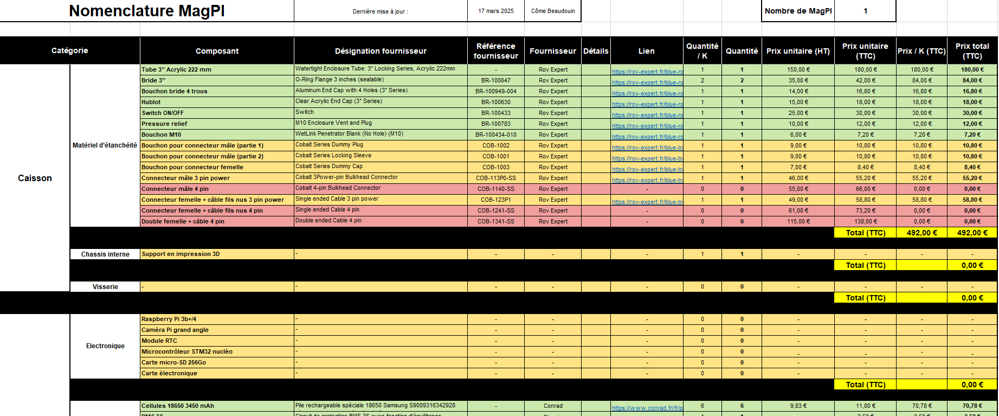

# **Nomenclature / Le sourcing**

Le sourcing est la première étape du projet et souvent la plus fastidieuse. Sourcer désigne le fait de rassembler tout ce qui sera nécéssaire pour fabriquer un **MagPI**. Ce projet demande des composants que l'on trouvera chez un grand-nombre de fournisseurs différents. De plus, ces fournisseurs peuvent différer en fonction du lieu et du moment où l'on va construire un **MagPI**.

**Attention :** Veiller à effectuer ce travail préparatoire bien avant la fabrication. En effet, certaines commandes peuvent avoir de long délais. Et cela sans compter le temps nécessaire pour le travail du sourcing lui-même. 

## **1. Présentation du fichier de sourcing**

- Télécharger le fichier de sourcing en cliquant **[ici](Nomenclature_MagPI.ods)**.
- Ouvrir le fichier de sourcing à l’aide d’un tableur. Bien qu’il ait été créé avec le logiciel propriétaire Excel, il peut être ouvert sans problème avec d’autres tableurs.

### **1.1 Détails du tableau "Nomenclature MagPI"**

 - **Catégorie :** Type ou famille du composant
 - **Composant :** Nom utilisé dans la documentation
 - **Désignation fournisseur :** Nom du composant tel qu’indiqué par le fournisseur
 - **Référence fournisseur :** Identifiant ou code produit attribué par le fournisseur
 - **Fournisseur :** Nom de l’entreprise ou du site proposant le composant
 - **Détails :** Informations techniques ou précisions complémentaires
 - **Lien :** Lien menant à la fiche produit ou à la page d’achat chez le fournisseur
 - **Quantité / K :** Quantité requise pour assembler un seul MagPI
 - **Quantité :** Quantité totale nécessaire en fonction du nombre de MagPI à assembler
 - **Prix unitaire :** Coût d’un seul exemplaire du composant
 - **Prix / K :** Coût total de ce composant pour un MagPI, en tenant compte de la quantité utilisée
 - **Prix total :** Coût total de ce composant pour l’ensemble des MagPI à fabriquer

## **2. Contribuer**

Si vous avez adapté le tableur en utilisant d'autres fournisseurs, par exemple en raison de votre localisation ou pour toute autre raison, ces informations pourraient être utiles à d'autres utilisateurs.