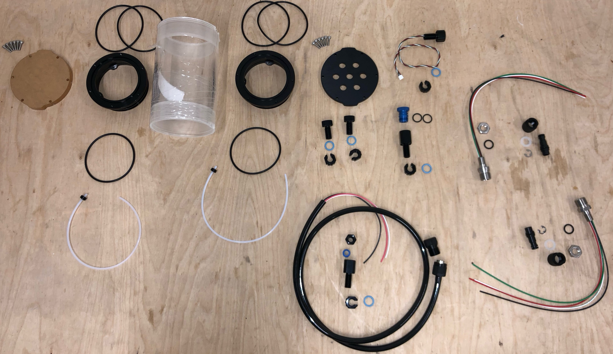
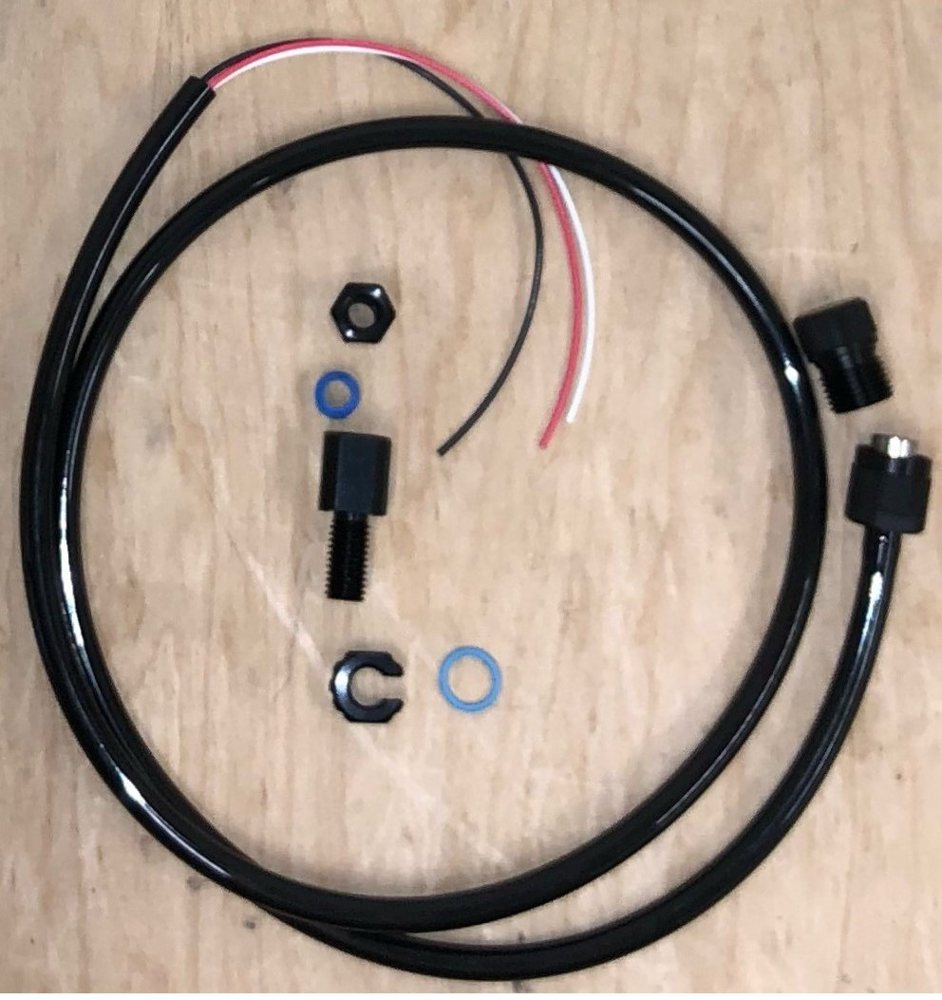
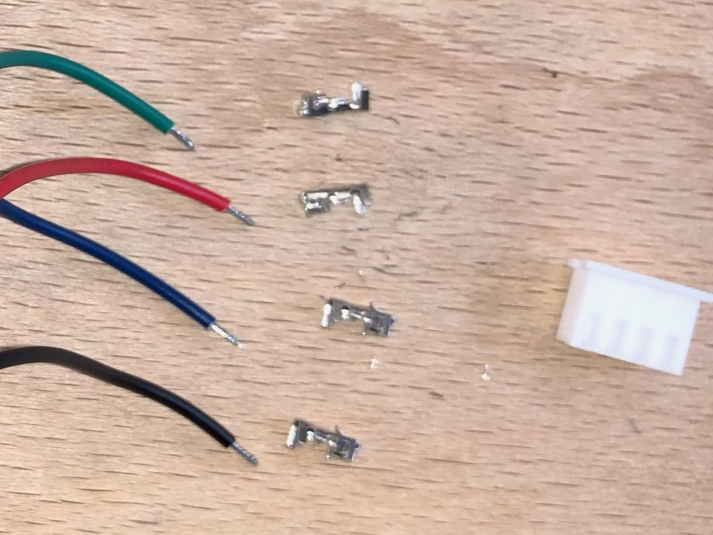
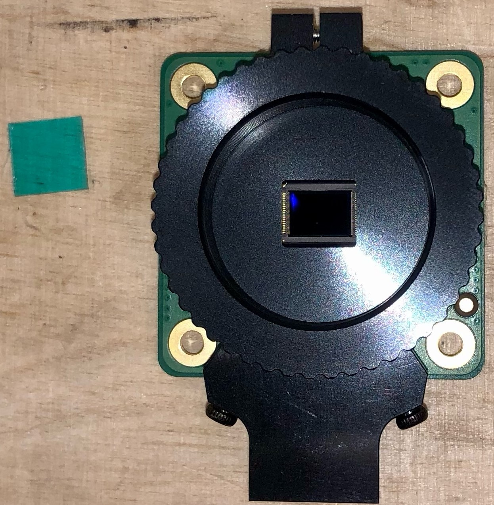
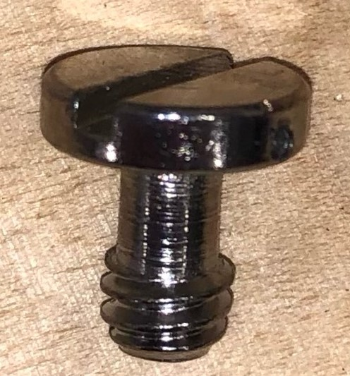
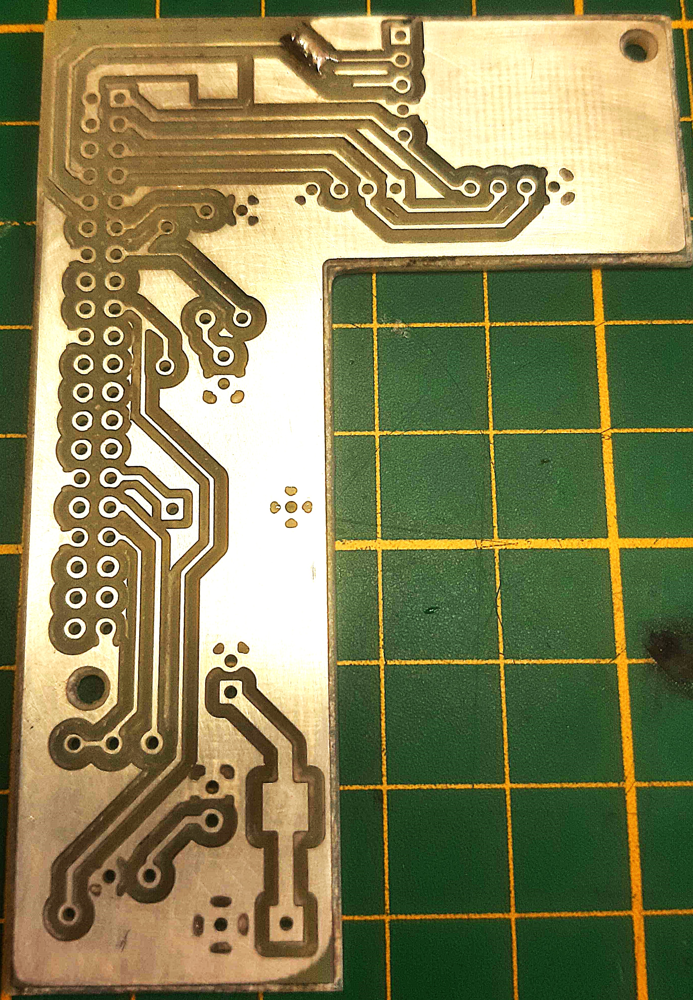
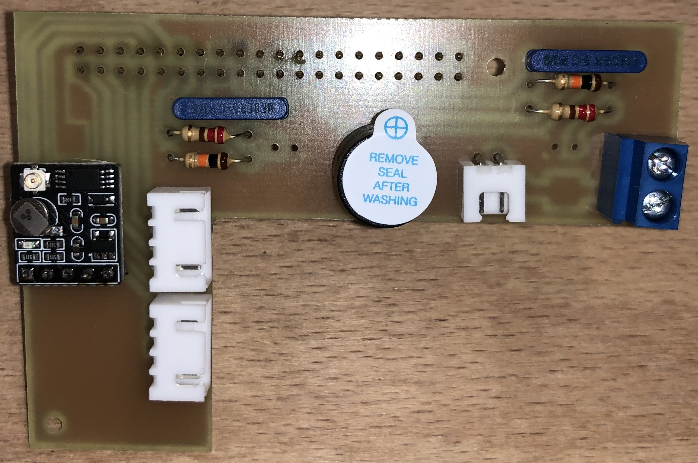

# Assemblage du capteur d'ambiance lumineuse RGB

- Souder le connecteur JST 4 pin sur les bornes GND 3.3V SDA SCL de la carte électronique du capteur. (La borne INT est inutilisée.) ATTENTION, les soudures se font du côté du capteur lumineux.
- Sur la structure mécanique, préformer les deux trous destinés à accueillir le capteur à l'aide d'un boulon de diamètre 2.5 mm.
- Fixer le capteur sur la structure mécanique à l'aide de boulons de diamètres 2.5 mm et de longueur 6 mm. (Des boulons plus longs peuvent être utilisés mais ils ne doivent pas dépasser de la structure.)

# Assemblage de la caméra

- Oter le filtre IR et le support pour la vis caméra.
- Fixer la capteur caméra sur la structure à l'aide de 4 boulons (diamètre 2.5 mm  et longueur 10 mm) et de 4 écrous. Attention à respecter l'orientation de la carte. 

# Assemblage de la carte électronique

- Fixer les radiateurs et le RTC sur la carte RPi.
- Assembler 4 boulons (diamètre 2.5 mm et longueur 10 mm) et 4 écrous sur chacun des trous de la RPi de la structure mécanique. Les écrous permettront de surélever légèrement la carte. 
- Positionner la carte RPi et la fixer avec deux écrous dans les coins avant droit et arrière gauche et avec deux entretoises  (diamètre 2.5 mm, hauteur 20 mm) dans les coins avant gauche et arrière droit.

# Caisson vidéo

  
 Outils 

  
  * gaine thermo {[Etape 1](assemblage_µkosmos.md#etape-1---réaliser-les-raccordements-entre-les-câbles-et-les-connecteurs)}
  * matériel soudure {[Etape 1](assemblage_µkosmos.md#etape-1---réaliser-les-raccordements-entre-les-câbles-et-les-connecteurs)}
  * couronne de forage (diamètre:...) {[Etape 3](assemblage_µkosmos.md#etape-3---percer-les-côtés-du-boitier)}
  * foret (diametre: ..) {[Etape 3](assemblage_µkosmos.md#etape-3---percer-les-côtés-du-boitier)}
  * perceuse {[Etape 3](assemblage_µkosmos.md#etape-3---percer-les-côtés-du-boitier)}
  * velcro {[Etape 4 et 5](assemblage_µkosmos.md#etape-4---fixer-le-receiver-gaming-la-carte-gps-et-le-ventilateur-dans-la-boite)}
  * tourne vis plat 
  * tourne vis cruciforme
  

  
 Materiel 

  
  [Tableau matériel caisson vidéo](/../µKOSMOS/hardware/02_materiel_boitier_electronique.md)
    

## Caisson étanche

### Réalisation du cable d'alimentation

- Avec une pince coupante, raccourcir le cable COB-1231 pour qu'il mesure 40 cm. Garder les fils noir, jaune et rouge. 
- Avec un cutter, enlever 10 cm de gaine noire. Attention à ne pas abimer les fils à l'intérieur. (Si c'était le cas glisser de la gaine thermoretractable au niveau de la coupure.)
- Couper le fil rouge à ras de la gaine pour ne conserver que le noir et le blanc. (On rappelle la convention : 5V Jaune et Noir. 12 V Rouge et Noir.)
- Dénuder les fils blancs et noir sur 7 mm.
- Y sertir des cosses dont on a vérifié qu'elles avaient le diamètre optimal.

 

- Suivre ensuite le tutoriel dont le lien est ci-dessous pour installer le presse étoupe

https://bluerobotics.com/learn/wetlink-penetrator-installation-guide/

https://www.youtube.com/watch?v=vigY82tsfOI&t=2s&ab_channel=BlueRobotics

 

### Connectiques caisson

- Sur le connecteur 4 pin Power Bulkhead COB-1140-SS, raccourcir les cables pour qu'ils mesurent 10 cm.
- Dénuder les fils sur 5 mm puis y sertir des cosses JST. Vérifier qu'elles tiennent fermement.

 
 
- De la même façon, couper les cables du capteur Température Pression pour qu'ils mesurent 10 cm.
- Dénuder les fils sur 3 mm puis y sertir les cosses. Les mords doivent prendre sur la gaine plastique des fils. 
- Re-écraser les mords à la pince plate pour que les cosses tiennent fermement. (Les fils du capteur TP sont un peu fins pour les cosses.)
- AVANT d'INSERER LES COSSES DANS LEUR CONNECTEUR JST, passer les cables des deux éléments dans le bouchon à 7 trous.
 
- Insérer les cosses dans les connecteurs JST en suivant le plan de cablage.

 

- Sur le connecteur 8 pin Power Bulkhead COB-1180-SS, raccourcir les cables pour qu'ils mesurent 7cm et sertir un connecteur ethernet

### Assemblage de la tape connectique

- Graisser les joints de chaque éléments sur la bouchon 7 trous
- Serrer les éléments M10 sur le bouchon
    
 

### Assemblage du hublot

 

## Impression de la structure 3D

## Carte électronique

### Pose des radiateurs sur la Raspberry Pi

- Mettre les radiateurs sur les puces de la RPi.

- Connecter ensuite le RTC à la RPi via le port BAT. Fixer la pile du RTC au dessus du port Ethernet avec du Velcros. 

### Modification du capteur Picam HQ

Pour un rendu de couleurs proche de celui de l'oeil humain, le capteur Picam HQ est équipé d'un filtre infra-rouge se matérialisant par une petite vitre bleue-verte devant le capteur. Ce filtre en plus de couper les infrarouges, atténue également une partie de la lumière rouge. Or celle-ci est déjà fortement atténuée par l'eau de mer. Afin d'éviter une telle perte inutile, le filtre IR du capteur Picam de KOSMOS doit être enlevé. Pour ce faire, un excellent tutoriel existe sur le site officiel de raspberry :  

https://www.raspberrypi.com/documentation/accessories/camera.html#ir-filter

A l'issue de cette opération, on obtient un capteur Picam HQ sans filtre IR (qui n'aura plus d'utilité par la suite).

### Préparation de la vis de fixation de la caméra

La vis de fixation de la caméra a initialement un arceau métallique facilitant son serrage. Cet arceau, trop encombrant dans le caisson doit être ôté à l'aide d'une pince coupante.  

 

### Réalisation de la carte électronique

  

 

### Assemblage des éléments

- Fixer la nappe et l'objectif à la caméra

- Fixer les entretoises à la Raspberry Pi dans les coins visibles sur la photo qui suit.
- Fixer la carte Raspberry Pi à la structure interne du caisson imprimée en 3D dans les deux coins restants.

 

- Fixer la caméra sur la structure 3D.
- Relier la nappe à la Raspberry Pi.
- Placer la carte électronique sur la Raspberry Pi et la fixer aux entretoises.

 
 
    
