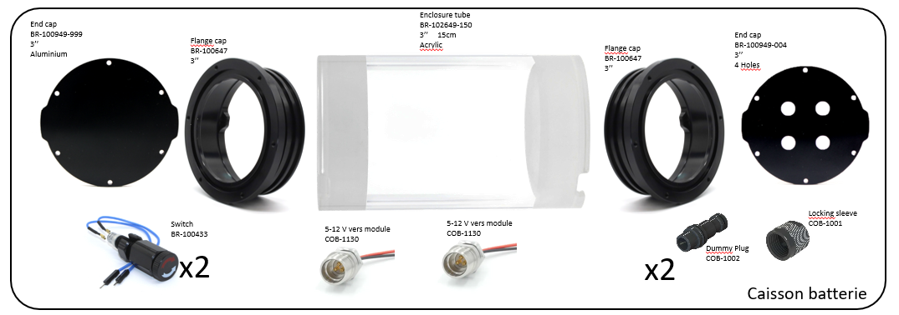
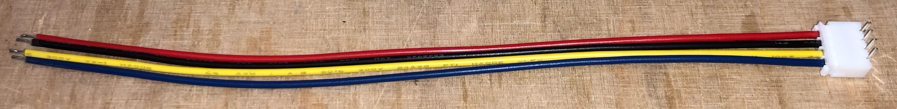

# Assemblage du caisson batterie et des éléments pour la recharge

## Caisson batterie

### Vue générale de l'étanchéité

### Vue générale de l'électronique interne

 

- Couper les connectiques originales de l'interrupeur pour les remplacer par des cosses à sertir.
- Tordre les pattes de l'interrupteur à 90° (pour des raisons de compacité)

  

- Sur deux connecteurs 3 pin Power Bulkhead COB-113P0-SS et raccourcir les cables pour qu'ils mesurent 10 cm.
- Sur l'un d'eux couper à ras le fil blanc, sur l'autre couper à ras le fil rouge. Le premier fournira du 5V pour le caisson vidéo, le second du 12V pour le caisson moteur.
- AVANT DE SOUDER LES CONNECTEURS XT30, visser ces deux connecteurs sur le bouchon à 4 trous.  

  

- Sur les fils issus des connecteurs 3 pin Power Bulkhead, souder des XT30 mâle en respectant la polarité. Distinguer le 5V (Noir&Blanc) et le 12V (Noir&Rouge) avec des gaines thermoretractables de couleurs différentes.

  

- Réaliser un raccord "XT30 femelle vers cosses à sertir" de 10 cm pour des fils noir et blanc. (Les récupérer du raccoucissement des cables COB-123P1 et COB-1241.)

- Réaliser un second raccord "XT30 femelle vers cosses à sertir" pour les fils noir et rouge mais repartir de ces cosses vers d'autres cosses. On choisira pour cela des cosses suffisamment larges pour y insérer deux cables à la fois. 

    

- Réaliser un raccord "XT60 mâle vers cosses à sertir" avec des cables noir et rouge. 

  

### Réalisation de la batterie

#### Soudure des accumulateurs

      

#### Soudure du BMS

    

  

  

#### Assemblage de la batterie

    

#### Insertion de la batterie

 

### Réalisation de la carte électronique de la batterie

 

  

 

  

 

 ## Recharge

### Clé de charge

### Cable de recharge (partie 1)

- Avec une pince coupante, raccourcir le cable COB-1231 pour qu'il mesure 20 cm.
- Avec l'outil Knipex, enlever 5 cm de gaine noire. Attention à ne pas abimer les fils à l'intérieur. (Si c'était le cas, glisser de la gaine thermoretractable au niveau de la coupure.)
- Raccourcir de 1 cm le morceau de gaine noire et le fendre dans la longueur.
- Enfiler 5 cm de gaine thermoretractable sur la gaine noire
- Dénuder les fils rouge et noir sur 5 mm.
- Enfiler un morceau de gaine thermoretractable de 2 cm sur chacun de ces deux fils en choississant leur diamètre afin qu'il puisse recouvrir la cosse du connecteur XT60 femelle.
- Souder les fils rouge et noir sur le connecteur XT60 en respectant les polarités : + sur rouge et - sur noir.
- Faire glisser les gaines thermoretractables et les chauffer.
- Englober les trois fils noir rouge et jaune (non soudé) avec la gaine fendue. Remonter la gaine thermorétractable et la chauffer. 

 

### Cable de recharge (partie 2) 

- Souder deux cables rouge et noir de 10 cm (récup', comme ceux des multimètres) sur un connecteur XT60 mâle en respectant la polarité.
- De l'autre côté, dénuder ces cables sur 3mmn, les étamer et les souquer dans le connecteur femelle fourni avec le chargeur. 

