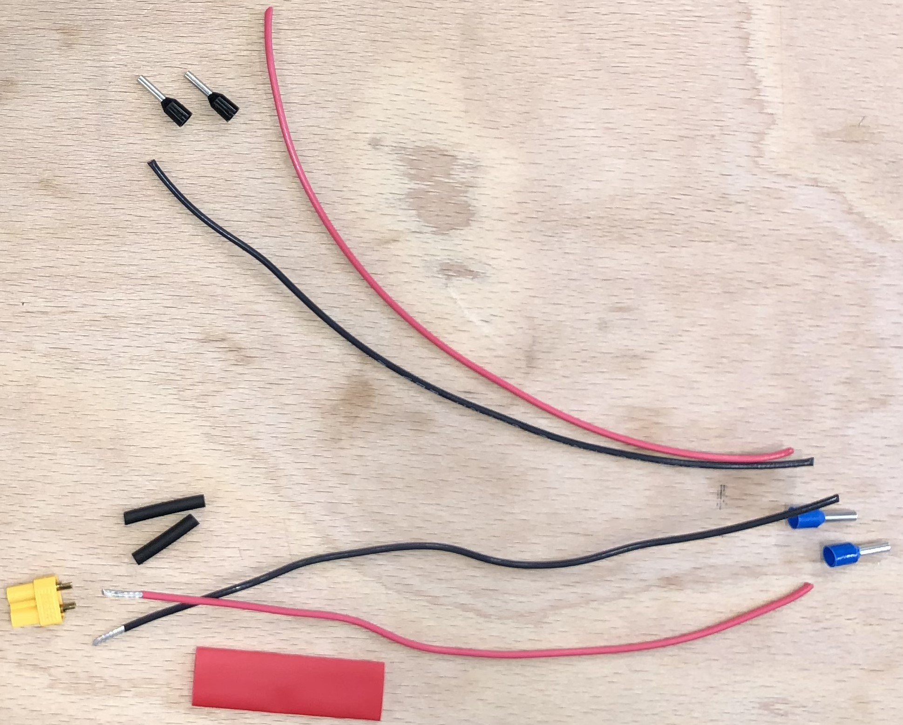
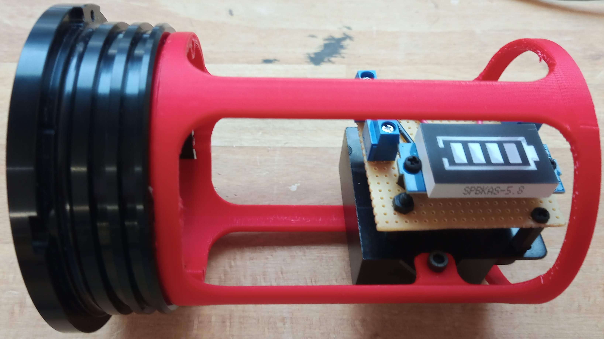

# Caisson batterie

## Etanchéité

- Assembler la "flange" avec le "end cap" en alumium en suivant le [tutoriel dédié](../../CommonElements/doc/02_flanges.md).  
- Fixer les deux connecteurs COB-1130, le connecteur COB-1140 et la purge sur le "end cap" 4 trous sur suivant le [tutoriel dédié](../../CommonElements/doc/03_etancheitedivers.md).

## Vue générale de l'électronique interne

 

AVANT DE REALISER LES ETAPES SUIVANTES, S'ASSURER QUE LES CONNECTEURS SONT BIEN PASSES PAR LES TROUS DU "END CAP".

### Connectiques 5V
- Couper les fils jaunes des COB-1130 et le fil blanc du COB-1140 à 6 cm puis les dénuder sur 1 cm.
- Sertir ces trois fils dans une cosse BV2. (On pourra tresser entre eux les deux fils qui rentreront du même côté de la cosse).
- Plaquer la cosse et les fils au plus proche du "end cap".

### Connectiques masse
- Couper les deux fils noir des COB-1130 à 6 cm et les dénuder sur 1 cm.
- Conserver une chute de ces fils et la dénuder des deux côtés sur 1 cm.
- Sertir ces trois fils noirs dans une cosse BV2. (On pourra tresser entre eux les deux fils qui rentreront du même côté de la cosse).
- Plaquer la cosse et les fils au plus proche du "end cap".
- Dénuder l'extrémité restante du fil noir sur 1 cm et lui sertir une ferrule en prenant soin de choisir le diamètre adapté.
- A l'aide d'une pince coupante, raccourcir la ferule de 1 mm.

### Connectiques 12V

- Couper les fils rouges des COB-1130 et le fil vert du COB-1140 à 6 cm puis les dénuder sur 1 cm.
- Conserver une chute de fil rouge et la dénuder des deux côtés sur 1 cm.
- Sertir les trois fils rouges et le fil vert dans une cosse BV2. (Deux de chaque côté qu'on tressera ensemble).
- Plaquer la cosse et les fils au plus proche du "end cap".
- Dénuder l'extrémité restante du fil rouge sur 1 cm et lui sertir une ferrule en prenant soin de choisir le diamètre adapté.
- A l'aide d'une pince coupante, raccourcir la ferule de 1 mm.

### Deux dernièrs cables venant du COB-1140

- Raccourcir de moitié les deux cables restants du COB-1140 (rouge et noir) et les dénuder sur 1 cm.
- Sertir une férule sur chacun d'entre eux.
- A l'aide d'une pince coupante, raccourcir la ferule du cable noir de 1 mm.

### Imprimer la structure interne

 

### Fixation du convertisseur 5V-12V

- Préparer les pas de vis des trous de fixation en vissant un boulon en métal de diamètre 2.5 mm dans les quatre trous qui servent à maintenir le convertisseur.
- Installer le convertisseur à sa place et visser les quatre boulons de diamètre 2.5 mm et de longueur 8 mm. Ces boulons ne doivent pas dépasser du côté de la batterie. Rajouter au pire des rondelles (ou des écrous).

### Installation de la batterie

ATTENTION, LES CABLES PROVENANT DE LA BATTERIE NE DOIVENT JAMAIS SE TOUCHER.
- Faire passer les fils de la batterie sous le convertisseur.
- Installer la batterie dans son compartiment puis la fixer avec un rilsan. L'élément de serrage doit être situé sur le dessus de la batterie.
- Couper le cable rouge de la batterie à 10 cm et le sertir avec une ferule.
- Couper le cable noir de la batterie à 10 cm et le sertir avec une ferule. On la raccourira de 1 mm à l'aide d'une pince coupante.
- Fixer cette ferule (du cable noir) dans la borne - du 12 V du convertisseur.

###

- Assembler le "end cap" 4 trous avec son "flange" en suivant le [tutoriel dédié](../../CommonElements/doc/02_flanges.md).
- Fixer la ferule du cable noir "masse" sur la borne - du 5 V du convertisseur.
- Fixer la ferule rouge 12 V sur la borne + du 12 V du convertisseur.
- Fixer la ferule du cable noir "5V" (provenant du COB-1140) sur la borne + du 5V du convertisseur.
- Dégager le cable rouge 12V. Il sera raccordé en tout dernier lieu au 12 V rouge de la batterie avec un Wago ou un domino.  
- Fixer l'ensembe "end cap + flange" sur la structure interne imprimée en 3D grâce à trois boulons 3 mm.
- Connecter les deux cables 12V grâce à un Wago ou un domino et tasser ces éléments sur un côté du convertisseur.

## Clé de fonctionnement

- Couper les connectiques originales de l'interrupeur pour les remplacer par des cosses à sertir.
- Tordre les pattes de l'interrupteur à 90° (pour des raisons de compacité)

  

- Sur deux connecteurs 3 pin Power Bulkhead COB-113P0-SS et raccourcir les cables pour qu'ils mesurent 10 cm.
- Sur l'un d'eux couper à ras le fil blanc, sur l'autre couper à ras le fil rouge. Le premier fournira du 5V pour le caisson vidéo, le second du 12V pour le caisson moteur.
- AVANT DE SOUDER LES CONNECTEURS XT30, visser ces deux connecteurs sur le bouchon à 4 trous.  

  

- Sur les fils issus des connecteurs 3 pin Power Bulkhead, souder des XT30 mâle en respectant la polarité. Distinguer le 5V (Noir&Blanc) et le 12V (Noir&Rouge) avec des gaines thermoretractables de couleurs différentes.

  

- Réaliser un raccord "XT30 femelle vers cosses à sertir" de 10 cm pour des fils noir et blanc. (Les récupérer du raccoucissement des cables COB-123P1 et COB-1241.)

- Réaliser un second raccord "XT30 femelle vers cosses à sertir" pour les fils noir et rouge mais repartir de ces cosses vers d'autres cosses. On choisira pour cela des cosses suffisamment larges pour y insérer deux cables à la fois. 

    

- Réaliser un raccord "XT60 mâle vers cosses à sertir" avec des cables noir et rouge. 

  

### Réalisation de la batterie

#### Soudure des accumulateurs

      

#### Soudure du BMS

    

  

  

#### Assemblage de la batterie

    

#### Insertion de la batterie

 

### Réalisation de la carte électronique de la batterie

 

  

 

  

 

## Element pour la recharge

## Clé de charge

 

## Cable de recharge (partie 1)

- Avec une pince coupante, raccourcir le cable COB-1231 pour qu'il mesure 20 cm.
- Avec l'outil Knipex, enlever 5 cm de gaine noire. Attention à ne pas abimer les fils à l'intérieur. (Si c'était le cas, glisser de la gaine thermoretractable au niveau de la coupure.)
- Raccourcir de 1 cm le morceau de gaine noire et le fendre dans la longueur.
- Enfiler 5 cm de gaine thermoretractable sur la gaine noire
- Dénuder les fils rouge et noir sur 5 mm.
- Enfiler un morceau de gaine thermoretractable de 2 cm sur chacun de ces deux fils en choississant leur diamètre afin qu'il puisse recouvrir la cosse du connecteur XT60 femelle.
- Souder les fils rouge et noir sur le connecteur XT60 en respectant les polarités : + sur rouge et - sur noir.
- Faire glisser les gaines thermoretractables et les chauffer.
- Englober les trois fils noir rouge et jaune (non soudé) avec la gaine fendue. Remonter la gaine thermorétractable et la chauffer. 

 

## Cable de recharge (partie 2) 

- Souder deux cables rouge et noir de 10 cm (récup', comme ceux des multimètres) sur un connecteur XT60 mâle en respectant la polarité.
- De l'autre côté, dénuder ces cables sur 3mmn, les étamer et les souquer dans le connecteur femelle fourni avec le chargeur. 

