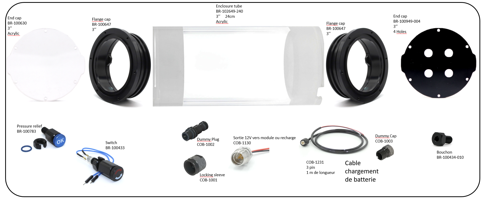

# **Nomenclature / Le sourcing**

Le sourcing est la première étape du projet et souvent la plus fastidieuse. Sourcer désigne le fait de rassembler tout ce qui sera nécéssaire pour fabriquer un **MagPI**. Ce projet demande des composants que l'on trouvera chez un grand-nombre de fournisseurs différents. De plus, ces fournisseurs peuvent différer en fonction du lieu et du moment où l'on va construire un **MagPI**.

**Attention :** Veiller à effectuer ces achats préparatoire bien avant la fabrication. En effet, certaines commandes peuvent avoir de long délais.

>[!Warning]
>Tous les liens vers les sites fournisseurs sont mis à titre indicatif.  
> **Dans le but d'une démarche low tech privilégier la récupération plutôt que l'achat.**
>
>Certains composants tels que les vis peuvent être modifiés et ne dépendent que de ce que vous avez déjà et de ce dont vous avez besoin.
>Il faut aussi noter que certaines vis sont comprises dans certains kits, dans le tableau ci-dessous vous trouverez toutes les vis nécessaire y compris celles intégrées dans les kits proposés.

**Indice substituabilité :**  
- :red_circle: : composant non modifiable
- :orange_circle: : certains paramètres du composant non modifiables
- :green_circle: : composant modifiable

## Caisson :

| Visuel | Référence | Quantité | Dénomination | Usage | Substituabilité | Tips/Conseil |
|-------|------------|----------|--------------------------|--------------------|-------------------------------|----------|
||BR-100630|1|Clear Acrylic End Cap (3″ Series)|Hublot|:red_circle:|Demander un devis sur [ROVExpert](https://rov-expert.fr/)|
||BR-102649-240|1|Watertight Enclosure Tube: 3" Locking Series, Acrylic 240mm|Tube|:red_circle:||
||BR-100647|2|O-Ring Flange 3 inches (sealable)|Brides|:red_circle:||
||BR-100949-004|1|Aluminium End Cap with 4 Holes (3" series)|Bouchon 4 trous|:red_circle:||
||BR-100433|1|Switch|Interrupteur|:red_circle:||
||BR-100783|1|M10 Enclosure Vent and Plug|Valve Pression|:red_circle:||
||BR-100434-010|1|WetLink Penetrator Blank (No Hole)|Bouchon M10|:red_circle:||
||COB-1130|1|Cobalt 3 pin Bulkhead Connector|Connecteur 3 Pin Batterie|:red_circle:||
||COB-1001|1|Cobalt 3 pin Bulkhead Connector|Connecteur 3 Pin Batterie|:red_circle:||
||COB-1002|1|Cobalt 3 pin Bulkhead Connector|Connecteur 3 Pin Batterie|:red_circle:||
||COB-1003|1|Cobalt 3 pin Bulkhead Connector|Connecteur 3 Pin Batterie|:red_circle:||

# Materiel Boitier Electronique

## Electronique:
| Visuel | Référence | Quantité | Dénomination | Usage |Substituabilité | Tips/Conseil |
|-------:|-----------|----------|--------------------------|--------------------|---------------------|----------|
|        |[Raspberry  SC0480](https://www.kubii.com/fr/modules-de-reseaux/3087-kit-antenne-officielle-raspberry-pi-3272496303287.html)          |         1| Antenne           |Permet d'augmenter la portée du signal    |<blockquote> :red_circle: </blockquote>          |          |
|        |[Varta 57977 101 111](https://fr.rs-online.com/web/p/batteries-externes/2309825?gb=s)           |         1| batterie 15Ah            |Alimente la raspberry    |<blockquote> :green_circle: </blockquote>          |          |
|        |[ITW SWITCHES 49-59113](https://fr.farnell.com/itw-switches/49-59113/commutateur-rond-vert/dp/734093?ost=734093)   |         1| bouton poussoir vert     |""            |<blockquote> :green_circle: </blockquote>          |          |
|        |[Raspberry RA168](https://www.kubii.com/fr/modules-de-reseaux/1922-module-gps-pour-raspberry-pi-kubii-3272496007888.html)            |         1| carte gps          |""                                         |<blockquote> :red_circle: </blockquote>          |          |
|        |[ARCOLECTRIC (BULGIN LIMITED) C6050ALAAC](https://fr.farnell.com/arcolectric/c6050alaac/commutateur-a-bascule-dpst-noir/dp/7674155)|         1| commutateur + cache étanche             |Permet d'allumer et d'éteindre le système     |<blockquote> :orange_circle: intérupteur avec auto maintient </blockquote>          |         |
|        |[THine Solutions, Inc. THSER101](https://fr.rs-online.com/web/p/hat-et-complements-raspberry-pi/2206246?redirect-relevancy-data=7365617263685F636173636164655F6F726465723D31267365617263685F696E746572666163655F6E616D653D4931384E53656172636847656E65726963267365617263685F6D617463685F6D6F64653D6D61746368616C6C7061727469616C267365617263685F7061747465726E5F6D6174636865643D5E2E2A24267365617263685F747970653D43415443485F414C4C5F44454641554C54267365617263685F7370656C6C5F636F72726563745F6170706C6965643D59267365617263685F77696C645F63617264696E675F6D6F64653D4E4F4E45267365617263685F6B6579776F72643D5448696E6520536F6C7574696F6E732C20496E632E204361626C6520457874656E73696F6E204B697420666F72205261737062657272792050692043616D267365617263685F6B6579776F72645F6170703D5448696E6520536F6C7574696F6E732C20496E632E204361626C6520457874656E73696F6E204B697420666F72205261737062657272792050692043616D26)           |         1| kit d'extension ethernet |"Permettra à la camera et à la Raspberry de communiquer ensemble"              |<blockquote> :red_circle: </blockquote>          |           |
|        |[gaming_receiver](https://www.amazon.fr/Dhaose-Contr%C3%B4leur-Vibration-Bluetooth-Ergonomique/dp/B08JGMFRGC/ref=sr_1_5?adgrpid=572275035&hvadid=80607978251784&hvbmt=be&hvdev=c&hvlocphy=127027&hvnetw=s&hvqmt=e&hvtargid=kwd-9285639436%3Aloc-66&keywords=manette+xbox+360+sans+fil&)          |         1| Manette Xbox + Wireless gaming receiver     |Permet de controller kosmos (mouement, camera)  Permet de faire le lien avec la manète de Xbox et la crte raspberry                |<blockquote> :red_circle: </blockquote>          |          |
|        |[RASPBERRY-PI RPI4-MODBP-4GB](https://fr.farnell.com/raspberry-pi/rpi4-modbp-4gb/raspberry-pi-4-model-b-4gb/dp/3051887?st=rpi4) |         1| raspberry PI4 4GB        |Contient le programme de fonctionnement du µkosmos     |<blockquote> :red_circle: </blockquote>          |          |
|        |[MULTICOMP MC002684](https://fr.farnell.com/multicomp/mc002684/ventilateur-40x40x10mm-5vdc/dp/3050784) |         1| ventilateur 5V          |Permet de refroidir le système      |<blockquote> :orange_circle: _5V_ </blockquote>          |          |

## **1. Présentation du fichier de sourcing**

- Télécharger le fichier de sourcing en cliquant **[ici](Nomenclature_MagPI.ods)**.
- Ouvrir le fichier de sourcing à l’aide d’un tableur. Bien qu’il ait été créé avec le logiciel propriétaire Excel, il peut être ouvert sans problème avec d’autres tableurs.

### **1.1 Détails du tableau "Nomenclature MagPI"**

 - **Catégorie :** Type ou famille du composant
 - **Composant :** Nom utilisé dans la documentation
 - **Désignation fournisseur :** Nom du composant tel qu’indiqué par le fournisseur
 - **Référence fournisseur :** Identifiant ou code produit attribué par le fournisseur
 - **Fournisseur :** Nom de l’entreprise ou du site proposant le composant
 - **Détails :** Informations techniques ou précisions complémentaires
 - **Lien :** Lien menant à la fiche produit ou à la page d’achat chez le fournisseur
 - **Quantité / K :** Quantité requise pour assembler un seul MagPI
 - **Quantité :** Quantité totale nécessaire en fonction du nombre de MagPI à assembler
 - **Prix unitaire :** Coût d’un seul exemplaire du composant
 - **Prix / K :** Coût total de ce composant pour un MagPI, en tenant compte de la quantité utilisée
 - **Prix total :** Coût total de ce composant pour l’ensemble des MagPI à fabriquer

## **2. Contribuer**

Si vous avez adapté le tableur en utilisant d'autres fournisseurs, par exemple en raison de votre localisation ou pour toute autre raison, ces informations pourraient être utiles à d'autres utilisateurs.

#Matériel général

>[!Note]
>Pour désigner les spécificités d'une vis on utilise des lettres. Ici la lettre M signifie que la vis à un filetage métrique (ISO). Le chiffre qui suit le M correspond au diamètre en mm. La valeur d'après correspond à la longueur du filetage de la vis.

  
 Sommaire 

  
  1. [Electronique](01_materiel_general.md#electronique-)
  2. [Câble](01_materiel_general.md#câble-)
  3. [Connecteur](01_materiel_general.md#connecteur-)
  4. [Mécanique](01_materiel_general.md#mécanique-)
  5. [Visserie](01_materiel_general.md#visserie-)
  6. [Consommable](01_materiel_general.md#consommable-)
  7. [Outils](01_materiel_general.md#outils-)
      

## Electronique :
| Visuel | Référence | Quantité | Dénomination | Usage | Substituabilité | Tips/Conseil |
|-------|-----------|----------|--------------------------|--------------------|-------------------------------|----------|
|||||||

## Câble :
| Visuel | Référence | Quantité | Dénomination | Usage | Substituabilité | Tips/Conseil |
|-------|-----------|----------|--------------------------|--------------------|-------------------------------|----------|
|||||||

## Connecteur :
| Visuel | Référence | Quantité | Dénomination | Usage | Substituabilité | Tips/Conseil |
|-------|-----------|----------|--------------------------|--------------------|-------------------------------|----------|
|||||||

## Mécanique :
| Visuel | Référence | Quantité | Dénomination | Usage | Substituabilité | Tips/Conseil |
|-------|-----------|----------|--------------------------|--------------------|-------------------------------|----------|
|||||||

## Visserie :
| Visuel | Référence | Quantité | Dénomination | Usage | Substituabilité | Tips/Conseil |
|-------|-----------|----------|--------------------------|--------------------|-------------------------------|----------|
|||||||

## Consommable :
| Visuel | Référence | Quantité | Dénomination | Usage | Substituabilité | Tips/Conseil |
|-------|-----------|----------|--------------------------|--------------------|-------------------------------|----------|
|||||||

## Outils :
| Visuel | Référence | Quantité | Dénomination | Usage | Substituabilité | Tips/Conseil |
|-------|-----------|----------|--------------------------|--------------------|-------------------------------|----------|
|||||||

