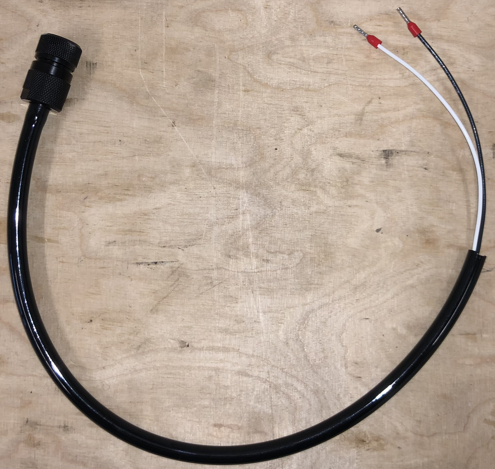
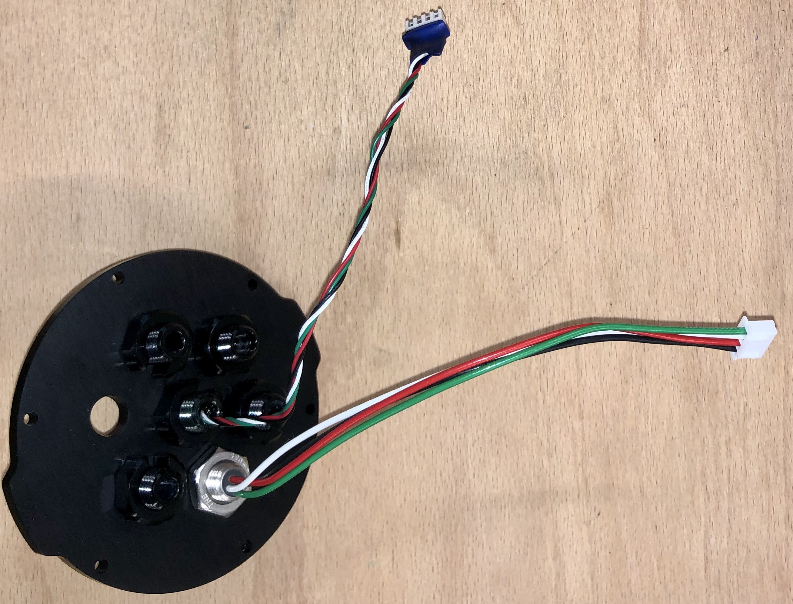
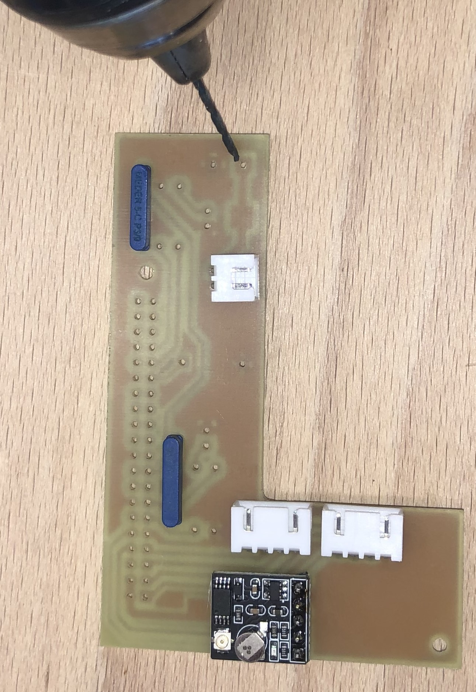
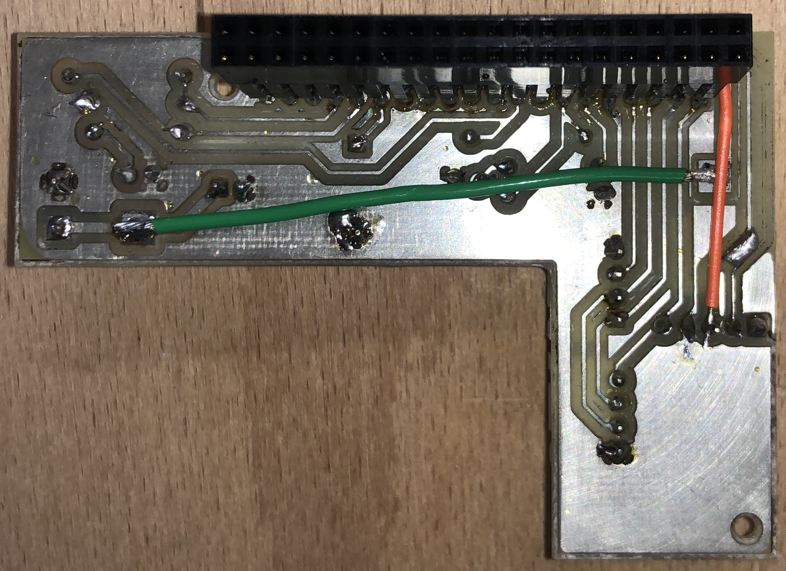
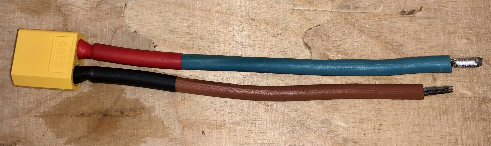
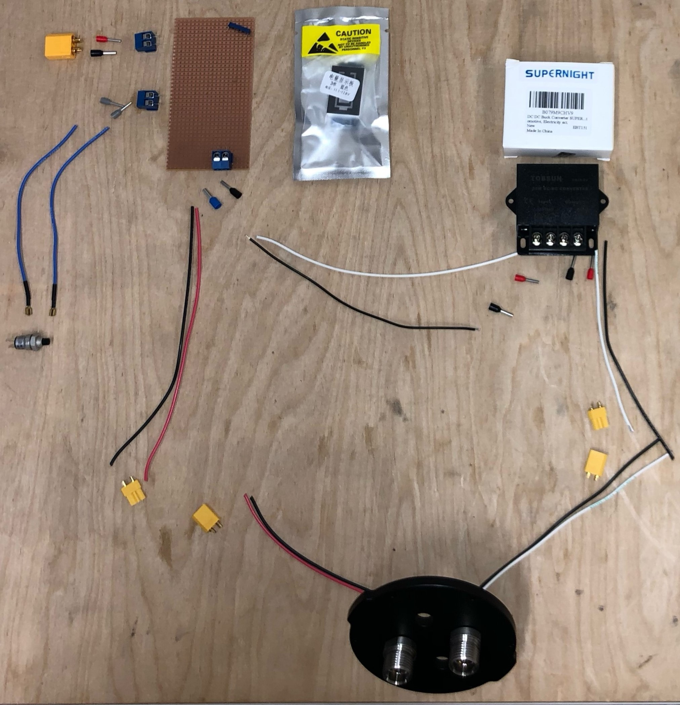
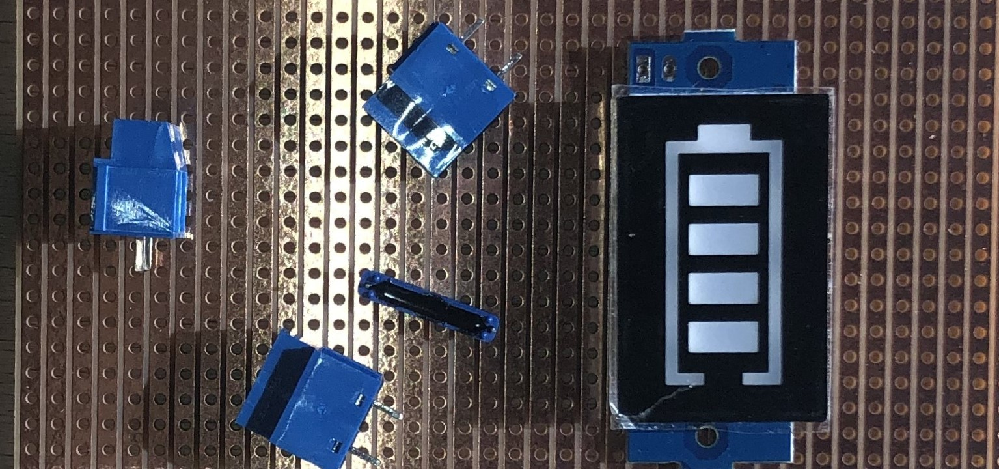

  
 Sommaire 

  
  1. [Assemblage du caisson vidéo](assemblage_µkosmos.md#1-assemblage-du-boitier-électronique)
  2. [Assemblage du caisson batterie](assemblage_µkosmos.md#2-assemblage-du-caisson-vid%C3%A9o)
  3. [Assemblage du caisson moteur](assemblage_µkosmos.md#3-assemblage-du-tr%C3%A9pried)
      

> [!NOTE]
> Ces ouvertures permettront de placer les connecteurs.

> [!TIP]
> Réaliser une ouverture supplémentaire pour que l'air puisse circuler et refroidir le système
>
> Si votre boitier est différent réfléchisser à la meilleur manière de l'organiser à l'intérieur

# Assemblage KOSMOS version 4

## 1. Assemblage du caisson vidéo

  
 Outils 

  
  * gaine thermo {[Etape 1](assemblage_µkosmos.md#etape-1---réaliser-les-raccordements-entre-les-câbles-et-les-connecteurs)}
  * matériel soudure {[Etape 1](assemblage_µkosmos.md#etape-1---réaliser-les-raccordements-entre-les-câbles-et-les-connecteurs)}
  * couronne de forage (diamètre:...) {[Etape 3](assemblage_µkosmos.md#etape-3---percer-les-côtés-du-boitier)}
  * foret (diametre: ..) {[Etape 3](assemblage_µkosmos.md#etape-3---percer-les-côtés-du-boitier)}
  * perceuse {[Etape 3](assemblage_µkosmos.md#etape-3---percer-les-côtés-du-boitier)}
  * velcro {[Etape 4 et 5](assemblage_µkosmos.md#etape-4---fixer-le-receiver-gaming-la-carte-gps-et-le-ventilateur-dans-la-boite)}
  * tourne vis plat 
  * tourne vis cruciforme
  

  
 Materiel 

  
  [Tableau matériel caisson vidéo](/../µKOSMOS/hardware/02_materiel_boitier_electronique.md)
    

### Vue générale

### Pose des radiateurs sur la Raspberry Pi

- Mettre les radiateurs sur les puces de la RPi.

- Connecter ensuite le RTC à la RPi via le port BAT. Fixer la pile du RTC au dessus du port Ethernet avec du Velcros. 

### Modification du capteur Picam HQ

Pour un rendu de couleurs proche de celui de l'oeil humain, le capteur Picam HQ est équipé d'un filtre infra-rouge se matérialisant par une petite vitre bleue-verte devant le capteur. Ce filtre en plus de couper les infrarouges, atténue également une partie de la lumière rouge. Or celle-ci est déjà fortement atténuée par l'eau de mer. Afin d'éviter une telle perte inutile, le filtre IR du capteur Picam de KOSMOS doit être enlevé. Pour ce faire, un excellent tutoriel existe sur le site officiel de raspberry :  

https://www.raspberrypi.com/documentation/accessories/camera.html#ir-filter

A l'issue de cette opération, on obtient un capteur Picam HQ sans filtre IR (qui n'aura plus d'utilité par la suite).

### Préparation de la vis de fixation de la caméra

La vis de fixation de la caméra a initialement un arceau métallique facilitant son serrage. Cet arceau, trop encombrant dans le caisson doit être ôté à l'aide d'une pince coupante.  

 

### Réalisation du cable d'alimentation

- Avec une pince coupante, raccourcir le cable COB-123P1 pour qu'il mesure 40 cm. Garder les fils noir, blanc et rouge. La gaine ne sera plus utilisée.
- Avec un cutter, enlever 10 cm de gaine noire. Attention à ne pas abimer les fils à l'intérieur. (Si c'était le cas glisser de la gaine thermoretractable au niveau de la coupure.)
- Couper le fil rouge à ras de la gaine pour ne conserver que le noir et le blanc. (On rappelle la convention : 5V Blanc et Noir. 12 V Rouge et Noir.)
- Dénuder les fils blancs et noir sur 7 mm.
- Y sertir des cosses dont on a vérifié qu'elles avaient le diamètre optimal.

 

https://bluerobotics.com/learn/wetlink-penetrator-installation-guide/

https://www.youtube.com/watch?v=vigY82tsfOI&t=2s&ab_channel=BlueRobotics

### Connectiques caisson

- Sur le connecteur 4 pin Power Bulkhead COB-1140-SS, raccourcir les cables pour qu'ils mesurent 10 cm.
- Dénuder les fils sur 5 mm puis y sertir des cosses JST. Vérifier qu'elles tiennent fermement.
- De la même façon, couper les cables du capteur Température Pression pour qu'ils mesurent 10 cm.
- Dénuder les fils sur 3 mm puis y sertir les cosses. Les mords doivent prendre sur la gaine plastique des fils. 
- Re-écraser les mords à la pince plate pour que les cosses tiennent fermement. (Les fils du capteur TP sont un peu fins pour les cosses.)
- AVANT d'INSERER LES COSSES DANS LEUR CONNECTEUR JST, passer les cables des deux éléments dans le bouchon à 7 trous.
 
 

- Insérer les cosses dans les connecteurs JST en suivant le plan de cablage.

### Réalisation de la carte électronique

  

 

### Assemblage des éléments

- Fixer la nappe et l'objectif à la caméra

- Fixer les entretoises à la Raspberry Pi dans les coins visibles sur la photo qui suit.
- Fixer la carte Raspberry Pi à la structure interne du caisson imprimée en 3D dans les deux coins restants.

 

- Fixer la caméra sur la structure 3D.
- Relier la nappe à la Raspberry Pi.
- Placer la carte électronique sur la Raspberry Pi et la fixer aux entretoises.

 
 

## Assemblage du caisson batterie

### Cable de recharge 

- A l'aide de la petite clé fournie avec le chargeur, régler le transformateur sur 13.5 V
  

- Avec une pince coupante, raccourcir le cable COB-123P1 pour qu'il mesure 20 cm.
- Avec un cutter, enlever 5 cm de gaine noire. Attention à ne pas abimer les fils à l'intérieur. (Si c'était le cas glisser de la gaine thermoretractable au niveau de la coupure.)
- Raccourcir de 1 cm le morceau de gaine noire et le fendre dans la longueur.
- Enfiler 5 cm de gaine thermoretractable sur la gaine noire
- Dénuder les fils rouge et noir sur 5 mm.
- Enfiler un morceau de gaine thermoretractable de 2 cm sur chacun de ces deux fils en choississant leur diamètre afin qu'il puisse recouvrir la cosse du connecteur XT60 femelle.
- Souder les fils rouge et noir sur le connecteur XT60 en respectant les polarités : + sur rouge et - sur noir.
- Faire glisser les gaines thermoretractables et les chauffer.
- Englober les trois fils noir rouge et blanc (non soudé) avec la gaine fendue. Remonter la gaine thermorétractable et la chauffer. 

 

- Souder deux cables rouge et noir de 10 cm (récup', comme ceux des multimètres) sur un connecteur XT60 mâle en respectant la polarité.
- De l'autre côté, dénuder ces cables sur 3mmn, les étamer et les souquer dans le connecteur femelle fourni avec le chargeur. 

### Vue générale de l'étanchéité

### Vue générale de l'électronique interne

 

- Couper les connectiques originales de l'interrupeur pour les remplacer par des cosses à sertir.
- Tordre les pattes de l'interrupteur à 90° (pour des raisons de compacité)

  

- Sur deux connecteurs 3 pin Power Bulkhead COB-113P0-SS et raccourcir les cables pour qu'ils mesurent 10 cm.
- Sur l'un d'eux couper à ras le fil blanc, sur l'autre couper à ras le fil rouge. Le premier fournira du 5V pour le caisson vidéo, le second du 12V pour le caisson moteur.
- AVANT DE SOUDER LES CONNECTEURS XT30, visser ces deux connecteurs sur le bouchon à 4 trous.  

  

- Sur les fils issus des connecteurs 3 pin Power Bulkhead, souder des XT30 mâle en respectant la polarité. Distinguer le 5V (Noir&Blanc) et le 12V (Noir&Rouge) avec des gaines thermoretractables de couleurs différentes.

  

- Réaliser un raccord "XT30 femelle vers cosses à sertir" de 10 cm pour des fils noir et blanc. (Les récupérer du raccoucissement des cables COB-123P1 et COB-1241.)

- Réaliser un second raccord "XT30 femelle vers cosses à sertir" pour les fils noir et rouge mais repartir de ces cosses vers d'autres cosses. On choisira pour cela des cosses suffisamment larges pour y insérer deux cables à la fois. 

    

- Réaliser un raccord "XT60 mâle vers cosses à sertir" avec des cables noir et rouge. 

  

### Réalisation de la batterie

    

  

  

      

    

 

### Réalisation de la carte électronique de la batterie

 

  

 

  

 

### Installation Soft Arduino Moteur

- Installer le logiciel Arduino depuis le site https://www.arduino.cc/en/software
- Télécharger control_motor.ino depuis le github [KonkArLAb/kosmos_software le mettre dans un dossier du même nom](https://github.com/KonkArLab/kosmos_software/tree/dev_stereo_merge_imt)
- Placer ce fichier .ino dans un dossier nommé control_motor
- Lancer l'IDE Arduino et ouvrir control_motor.ino
- Brancher l'Arduino Nano à l'ordinateur via le port USB
- Effectuer l'installation demandée par l'IDE Arduino
- Dans l'onglet Tools, sélectionner le port COM auquel est branché l'Arduino Nano
- Dans l'onglet Tools, sélectionner la board Arduino Nano
- Dans l'onglet Tools, Manage Librairie. Taper "AccelStepper". Installer la librairie associée.
- Vérifier le code.
- Téléverser.

    
